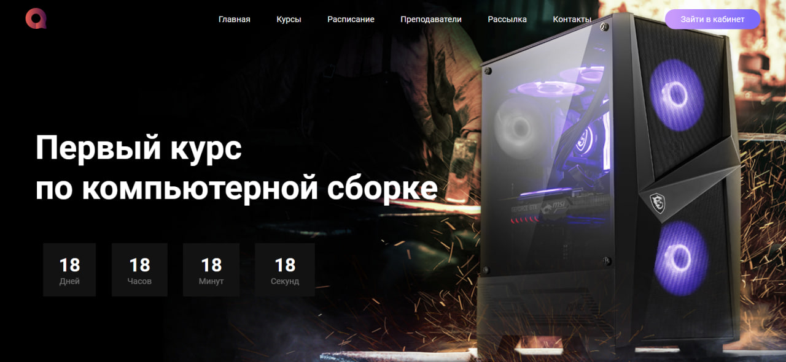

# FistCourse - [first computer course]

Layout of a simple landing page "First Computer Course"

## Features

- **Design**: simple, elegant and cool design.
- **Responsive Design**: Whether on desktop, tablet, or mobile, get the full experience with a responsive layout that adapts to your device.

## Technologies Used

- **SCSS**: For writing more efficient styles that compile down to CSS.
- **JavaScript**: For interactive web pages and dynamic user experiences.

## Setup

Clone the repository and run the following command to start the development server:
[https://github.com/Vergos1/project_FistCourse.git](https://github.com/Vergos1/project_FistCourse.git)

## Created by
Design and any crafted with 💜 by [Ihor Yanchuk](https://github.com/Vergos1). For more information or to view my other work, please visit [my portfolio](http://yanchuk.vinnytsia.ua/).

